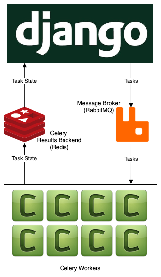

### The purpose of this app is to demonstrate a solution for managing concurrent Celery tasks via the [celery-progress](https://github.com/czue/celery-progress) package. 


Click this screenshot for a video demo.
[](https://www.youtube.com/watch?v=dWAJru1xx34 "Click to view on Youtube")

# Architecture




# Getting Started

1. Generate an API key at [api.nasa.gov](https://api.nasa.gov/) and add it to this app's [tasks.py file](demo_app/tasks.py)

2. Start RabbitMQ and Redis on Docker

```bash
docker run -d -p 5672:5672 rabbitmq
```

```bash
docker run -d -p 6379:6379 redis
```

3. From within this repo's root directory, run the following commands in order to install this project's dependencies in a [virtual environment](https://docs.python.org/3/tutorial/venv.html) and run a Django web server:

```bash
python3 -m venv myvenv
```

```bash
source myvenv/bin/activate
```

```bash
python3 -m pip install --upgrade pip
```

```bash
python3 -m pip install -r requirements.txt
```

```bash
python3 manage.py runserver
```

4. Open a second terminal window and run the following:

```bash
source myvenv/bin/activate
python3 -m celery -A demo_project worker -l info --concurrency=8
```
